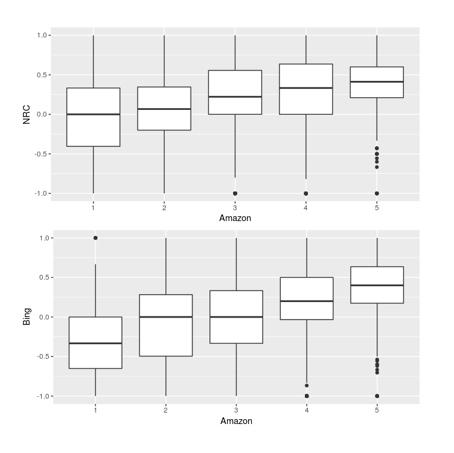

# Système recommandation

Projet consistant à construire un mini système de recommendation avec le logiciel R

## Récupération du dataset

```bash
python3 recuperation_dataset.py
```

## Installation des packages necessaires

```R
# A executer dans un terminal R
source("installation_packages.R")
```

## Lancement du système de recommandation

```R
# A executer dans un terminal R
source("main.R")
```

## Résultat attendu

A noter que ces résultats ont été fait à partir de 2 types d'analyse sentimentale qui sont:

- Bing
- Nrc

<p align="center">
  
</p>
